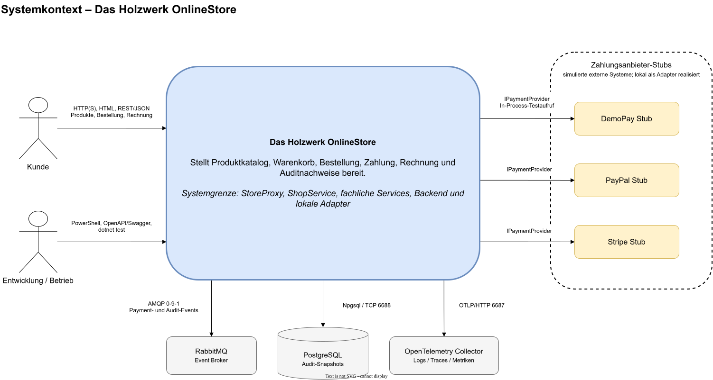
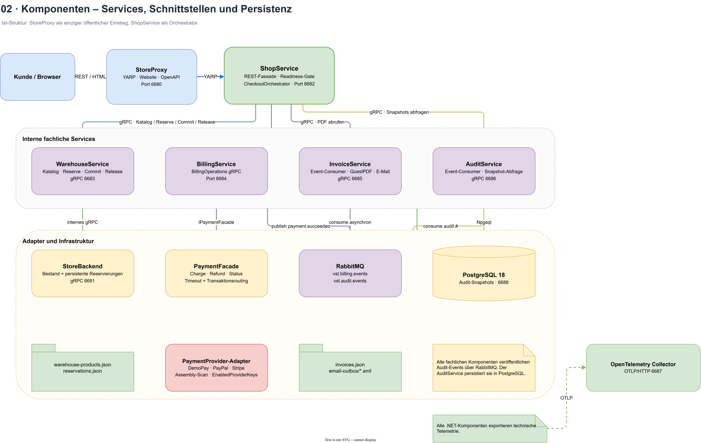
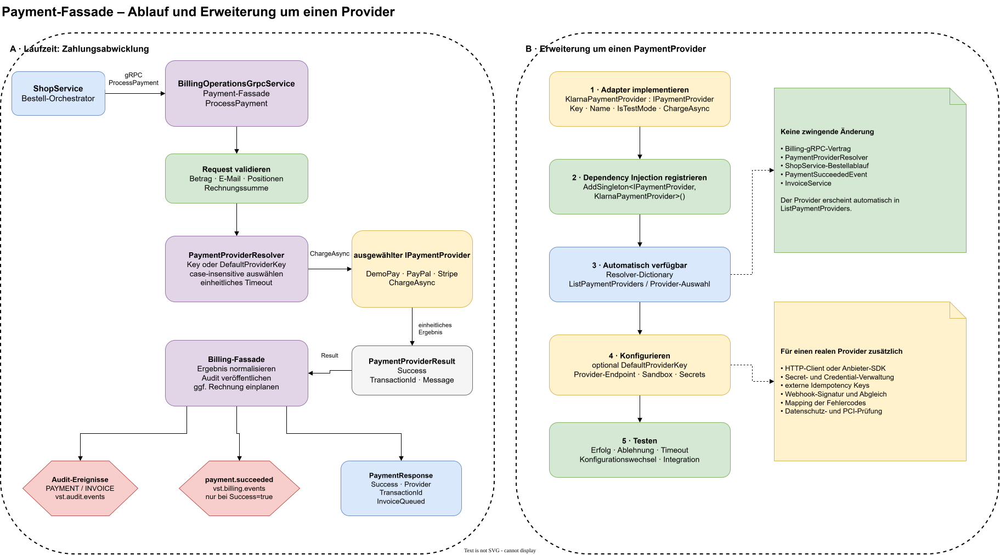
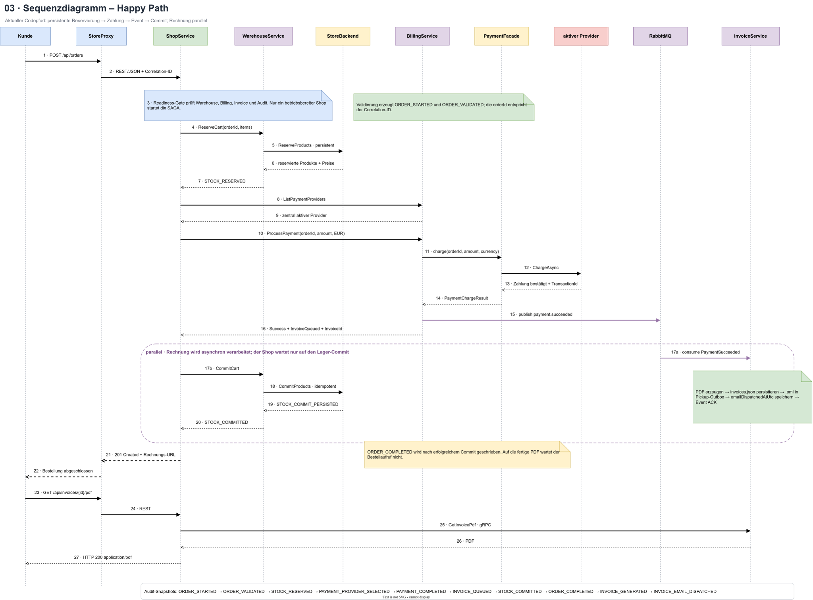
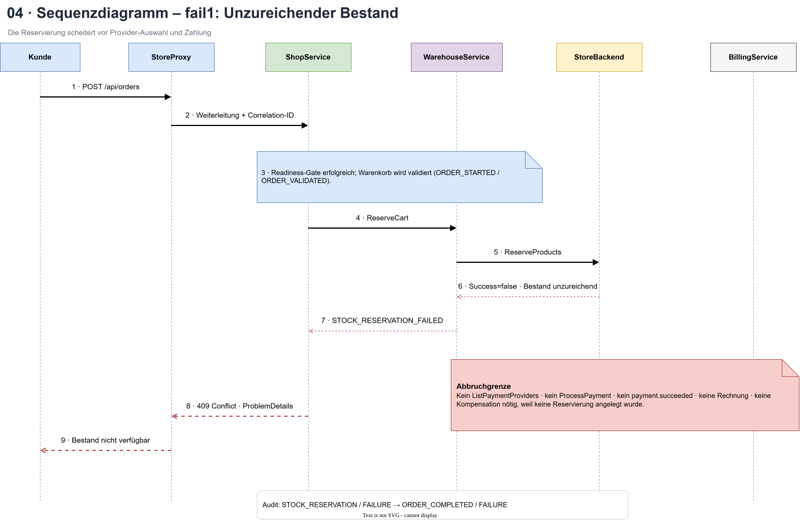
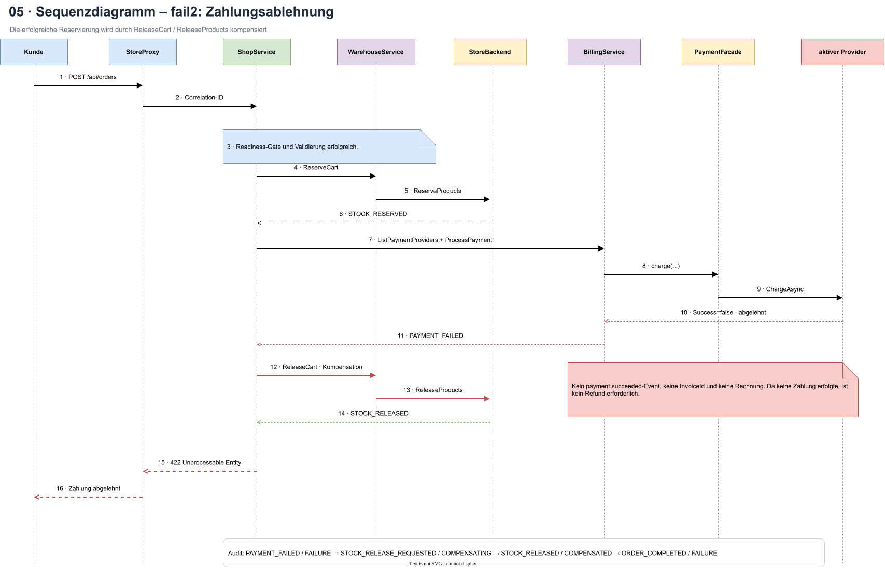
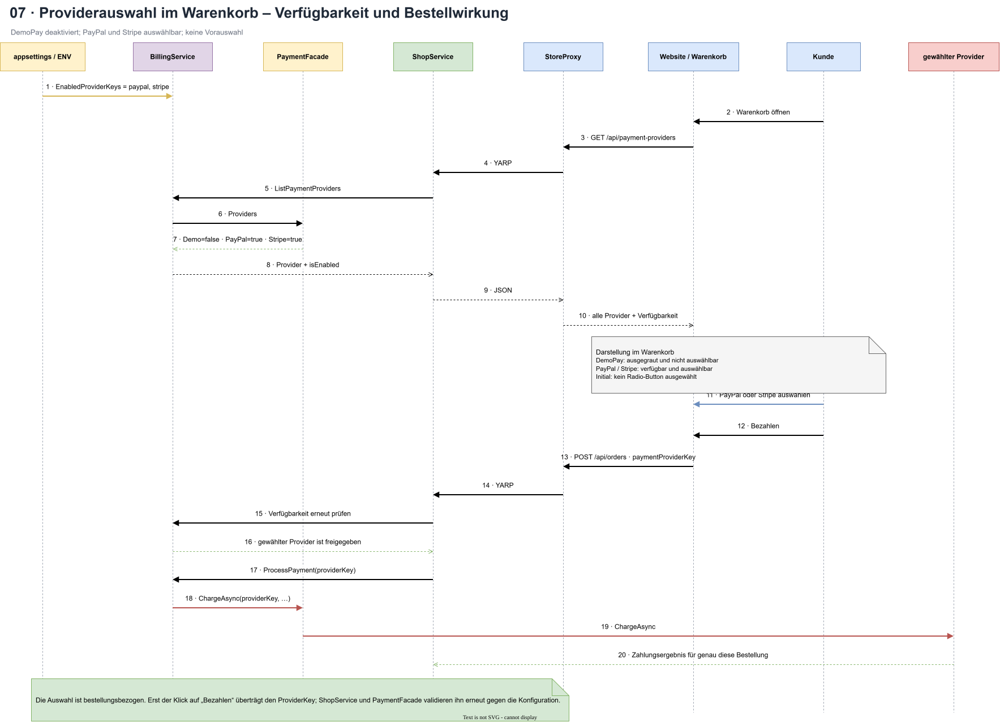
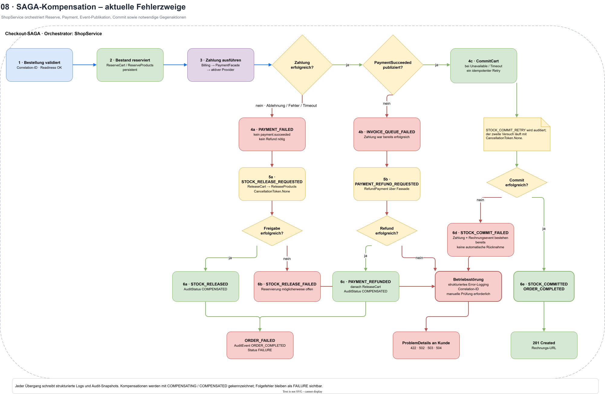

# Architektur des Holzwerk OnlineStore

| Merkmal | Wert |
| --- | --- |
| Dokumentstatus | Aktuell |
| Stand | 23. August 2026 |
| System | Holzwerk OnlineStore |
| Verbindliche Diagrammquelle | [`diagrams/online-store-architecture.drawio`](diagrams/online-store-architecture.drawio) |
| Anforderungsquelle | [`Requirements.txt`](Requirements.txt) |

## Inhaltsverzeichnis

1. [Ziel und Geltungsbereich](#1-ziel-und-geltungsbereich)
2. [Architekturüberblick](#2-architekturüberblick)
3. [Architekturprinzipien und Qualitätsziele](#3-architekturprinzipien-und-qualitätsziele)
4. [Systemkontext](#4-systemkontext)
5. [Bausteinsicht](#5-bausteinsicht)
   1. [Payment-Fassade und Provider-Erweiterung](#51-payment-fassade-und-provider-erweiterung)
6. [Laufzeitsicht](#6-laufzeitsicht)
   1. [Happy Path](#61-happy-path)
   2. [Fehlerfall fail1: unzureichender Bestand](#62-fehlerfall-fail1-unzureichender-bestand)
   3. [Fehlerfall fail2: Zahlungsablehnung](#63-fehlerfall-fail2-zahlungsablehnung)
   4. [Providerauswahl im Warenkorb](#64-providerauswahl-im-warenkorb)
   5. [SAGA-Kompensation bei Zahlungs- und Folgefehlern](#65-saga-kompensation-bei-zahlungs--und-folgefehlern)
7. [Schnittstellen und Infrastruktur](#7-schnittstellen-und-infrastruktur)
8. [Architekturentscheidungen](#8-architekturentscheidungen)
   1. [ADR-001: RabbitMQ als Message Broker](#adr-001-rabbitmq-als-message-broker)
   2. [ADR-002: PostgreSQL als Audit-Datenbank](#adr-002-postgresql-als-audit-datenbank)
   3. [ADR-003: Eigenständiges, ereignisbasiertes Auditing-System](#adr-003-eigenständiges-ereignisbasiertes-auditing-system)
9. [Betrieb und lokale Ausführung](#9-betrieb-und-lokale-ausführung)
10. [Pflege der Dokumentation](#10-pflege-der-dokumentation)

## 1. Ziel und Geltungsbereich

Dieses Dokument beschreibt die Architektur des Holzwerk OnlineStore. Es führt
die Systemgrenzen, Laufzeitbausteine, Kommunikationsbeziehungen und wesentlichen
Architekturentscheidungen zusammen. Der dokumentierte Stand umfasst den
Bestell-, Zahlungs-, Rechnungs- und Auditprozess sowie die dafür benötigte lokale
Infrastruktur.

Die Dokumentation bezieht sich auf die Entwicklungs- und Demonstrationsumgebung.
Insbesondere lokale Zugangsdaten, Ports und Zahlungsanbieter-Stubs sind keine
Produktionskonfiguration.

## 2. Architekturüberblick

Der OnlineStore ist als verteiltes .NET-System mit einer öffentlichen
REST-Fassade und internen gRPC-Diensten aufgebaut. Der Kunde greift ausschließlich
über den StoreProxy auf das System zu. Der ShopService orchestriert den
Bestellprozess und delegiert fachliche Aufgaben an die spezialisierten Services.

Der typische Ablauf ist:

1. Der StoreProxy leitet den HTTP-Aufruf an den ShopService weiter.
2. Der ShopService lädt Produktdaten und reserviert Bestand über den
   WarehouseService und den StoreBackend.
3. Der BillingService wählt den konfigurierten Zahlungsanbieter-Stub und führt
   die Zahlung aus.
4. Nach erfolgreicher Zahlung veröffentlicht der BillingService ein
   `payment.succeeded`-Ereignis über RabbitMQ.
5. Der InvoiceService verarbeitet das Ereignis asynchron, erzeugt Rechnung und
   E-Mail und legt diese im Pickup-Outbox-Verzeichnis ab.
6. Die beteiligten Services veröffentlichen fachliche Audit-Ereignisse. Der
   AuditService persistiert daraus unveränderliche Snapshots in PostgreSQL.
7. Alle .NET-Komponenten exportieren technische Telemetrie an den
   OpenTelemetry Collector.

Zahlungsanbieter wie DemoPay, PayPal und Stripe sind in dieser Umgebung als
lokale Stubs hinter dem Interface `IPaymentProvider` implementiert. Sie ersetzen
die Anbindung realer externer Zahlungssysteme.

## 3. Architekturprinzipien und Qualitätsziele

- **Klare Systemgrenze:** Externe HTTP-Aufrufe laufen über den StoreProxy; die
  internen Services werden nicht direkt vom Browser angesprochen.
- **Fachliche Trennung:** Bestand, Zahlung, Rechnung und Auditing besitzen
  getrennte Verantwortlichkeiten und eigene Schnittstellen.
- **Lose Kopplung:** Zeitlich entkoppelbare Abläufe wie Rechnungserstellung und
  Auditing verwenden Ereignisse statt synchroner Serviceketten.
- **Nachvollziehbarkeit:** Eine Correlation-ID verbindet Requests, Nachrichten,
  Telemetrie und Audit-Snapshots eines Bestellvorgangs.
- **Fehlerisolation:** Ein Ausfall des Audit-Publishers darf den fachlichen
  Bestellprozess nicht abbrechen. Fehlerhafte Nachrichten gelangen in
  Dead-Letter-Queues.
- **Idempotenz:** Event-IDs und Datenbank-Constraints verhindern doppelte
  Audit-Snapshots bei erneuter Nachrichtenzustellung.
- **Datenhoheit:** Nur der AuditService greift auf die Audit-Datenbank zu. Andere
  Services verwenden Ereignisse zum Schreiben und gRPC zum Lesen.
- **Beobachtbarkeit:** Strukturiertes Logging, Traces und Metriken ergänzen das
  fachliche Auditing, ersetzen es aber nicht.

## 4. Systemkontext

Das Kontextdiagramm zeigt die Systemgrenze, die Akteure sowie alle externen
Infrastrukturbeziehungen. Der Kunde nutzt die Web- und REST-Funktionen.
Entwicklung und Betrieb verwenden Startskripte, OpenAPI/Swagger und Tests. Die
Zahlungsanbieter-Stubs repräsentieren simulierte externe Zahlungssysteme.



*Abbildung 1: Systemkontext mit Akteuren, externen Systemen und
Kommunikationsprotokollen.*

## 5. Bausteinsicht

| Baustein | Port | Verantwortung |
| --- | ---: | --- |
| StoreProxy | 6680 | Öffentlicher Einstiegspunkt, YARP-Routing, REST/HTML |
| StoreBackend | 6681 | Produkt- und Bestandsdaten |
| ShopService | 6682 | REST-Fassade und Orchestrierung des Bestellprozesses |
| WarehouseService | 6683 | Produktkatalog, Reservierung und Freigabe von Bestand |
| BillingService | 6684 | Payment-Fassade, Provider-Auswahl und Zahlungsereignisse |
| InvoiceService | 6685 | Rechnungserzeugung, PDF und E-Mail-Pickup-Outbox |
| AuditService | 6686 | Konsum, Persistenz und Abfrage von Audit-Snapshots |
| OpenTelemetry Collector | 6687 | Annahme technischer Logs, Traces und Metriken |
| PostgreSQL | 6688 | Persistenz der unveränderlichen Audit-Snapshots |
| RabbitMQ | 5672 | Asynchroner Transport von Rechnungs- und Audit-Ereignissen |

Die fachlichen Services kommunizieren intern über gRPC und HTTP/2. RabbitMQ
entkoppelt BillingService und InvoiceService sowie alle Audit-Publisher vom
AuditService. PostgreSQL wird ausschließlich vom AuditService verwendet.



*Abbildung 2: Services, Adapter, Message Broker, Datenbank und technische
Infrastruktur.*

### 5.1 Payment-Fassade und Provider-Erweiterung

Die Payment-Fassade trennt den ShopService von den konkreten
Zahlungsanbieter-Adaptern. Der `BillingOperationsGrpcService` validiert den
Request und delegiert `Charge`, `Refund` und transaktionsbezogene Statusabfragen
ausschließlich an die `PaymentFacade`. `EnabledProviderKeys` legt fest, welche
Adapter für neue Bestellungen verfügbar sind; der Request benennt einen dieser
Adapter über `paymentProviderKey`. Die Fassade validiert die Auswahl, behandelt
Timeouts einheitlich und merkt sich für Refund und Status den ursprünglichen
Provider. Alle Adapter implementieren `IPaymentProvider`.

Die rechte Diagrammhälfte zeigt am Beispiel eines zusätzlichen
`KlarnaPaymentProvider`, welche Erweiterungen notwendig wären. Fassade,
gRPC-Vertrag, ShopService und Rechnungsereignis bleiben dabei unverändert. Der
Adapter wird beim Start automatisch entdeckt. Für eine reale Anbindung kommen insbesondere Credentials,
Idempotency Keys, Webhook-Prüfung und anbieterbezogenes Fehlermapping hinzu.



*Abbildung 3: Zahlungsablauf sowie Erweiterungspunkte für einen zusätzlichen
PaymentProvider.*

## 6. Laufzeitsicht

### 6.1 Happy Path

Im Erfolgsfall werden Bestand und Zahlung bestätigt. Der BillingService
veröffentlicht anschließend `payment.succeeded`. Der InvoiceService erzeugt die
Rechnungsartefakte asynchron. Die HTTP-Antwort enthält die Bestell- und
Rechnungsinformationen.



*Abbildung 4: Erfolgreicher Bestell-, Zahlungs- und Rechnungsablauf.*

### 6.2 Fehlerfall fail1: unzureichender Bestand

Kann der WarehouseService den Warenkorb nicht reservieren, endet die Bestellung
mit einem Konflikt. Der BillingService wird nicht aufgerufen, es entsteht kein
`payment.succeeded`-Ereignis und keine Rechnung.



*Abbildung 5: Abbruch vor der Zahlung bei unzureichendem Bestand.*

### 6.3 Fehlerfall fail2: Zahlungsablehnung

Lehnt der Zahlungsanbieter die Zahlung ab, veranlasst der ShopService die
Kompensation der zuvor erfolgreichen Bestandsreservierung. Es wird kein
Rechnungsereignis veröffentlicht.



*Abbildung 6: Zahlungsablehnung mit Freigabe des reservierten Bestands.*

### 6.4 Providerauswahl im Warenkorb

Der Kunde kann den Zahlungsanbieter in der Warenkorbansicht für die aktuelle
Bestellung auswählen. DemoPay bleibt als registrierter Testadapter sichtbar,
ist gemäß Konfiguration jedoch deaktiviert und wird ausgegraut. PayPal und
Stripe sind aktiviert; beim Öffnen des Warenkorbs ist zunächst keiner von beiden
ausgewählt. Bis zum Klick auf „Bezahlen“ bleibt die Auswahl lokaler
Browserzustand und löst weder Reservierung noch Zahlung aus. Beim
Checkout wird der `paymentProviderKey` mit der Bestellung übertragen,
serverseitig validiert, auditiert und ausschließlich über die Payment-Fassade
an den ausgewählten Adapter weitergereicht.

`EnabledProviderKeys` steuert die Verfügbarkeit; `ActiveProviderKey` bleibt nur
als serverseitiger Fallback für interne oder ältere gRPC-Aufrufer bestehen und
erzeugt keine Browser-Vorauswahl. Nach Beginn des Checkouts wird die Auswahl
gesperrt.



*Abbildung 7: Konsequenzen einer bestellungsbezogenen Providerauswahl in der
Warenkorbansicht.*

### 6.5 SAGA-Kompensation bei Zahlungs- und Folgefehlern

Ist der Bestand bereits reserviert und die Zahlung wird abgelehnt, läuft in ein
Timeout oder erreicht den BillingService beziehungsweise Provider nicht, startet
der ShopService die Kompensation. Zuerst wird der Zustand
`STOCK_RELEASE_REQUESTED` mit `COMPENSATING` auditiert. Anschließend ruft der
ShopService `ReleaseCart` beim WarehouseService auf, welcher die Mengen mit
`ReleaseProducts` im StoreBackend zurückgibt.

Bei Erfolg entsteht ein `STOCK_RELEASE`-Snapshot mit `COMPENSATED`. Schlägt auch
die Kompensation fehl, werden `STOCK_RELEASE_FAILED`, strukturiertes
Error-Logging und ein Audit-Snapshot mit `FAILURE` erzeugt; die möglicherweise
offene Reservierung muss dann betrieblich über die Correlation-ID geprüft
werden. Da keine erfolgreiche Zahlung existiert, wird kein Refund ausgelöst,
kein `payment.succeeded`-Ereignis veröffentlicht und keine Rechnung erzeugt.

Konnte `payment.succeeded` nach einer erfolgreichen Zahlung nicht dauerhaft
publiziert werden, startet die SAGA zuerst `PAYMENT_REFUND_REQUESTED` über die
Payment-Fassade und gibt nach `PAYMENT_REFUNDED` die Reservierung frei. Derselbe
Refund-und-Release-Pfad gilt, wenn `CommitCart` fachlich fehlschlägt oder nach
einem idempotenten Wiederholungsversuch weiterhin nicht bestätigt werden kann.
Ein vollständiger Gegenlauf endet mit `ROLLBACK_COMPLETED`, ein fehlerhafter mit
`ROLLBACK_FAILED`.

Ist das Ereignis dagegen bereits dauerhaft publiziert und nur seine asynchrone
Verarbeitung im InvoiceService gestört, bleibt die Zahlung bestehen. Der
InvoiceService führt mindestens drei Versuche aus und schreibt für jeden
Versuch `INVOICE_RETRY_SCHEDULED` beziehungsweise
`INVOICE_RETRY_EXHAUSTED`; anschließend werden
`INVOICE_PROCESSING_FAILED` und die Dead-Letter-Weiterleitung dokumentiert.



*Abbildung 8: SAGA-Zustände, Refund, Bestandskompensation und terminale
Rollback-Statuswerte.*

## 7. Schnittstellen und Infrastruktur

### Synchrone Schnittstellen

| Beziehung | Technik | Zweck |
| --- | --- | --- |
| Kunde → StoreProxy | HTTP(S), HTML, REST/JSON | Produktkatalog, Bestellung und Rechnungszugriff |
| StoreProxy → ShopService | YARP/HTTP | Weiterleitung der öffentlichen Ressourcen-URLs |
| ShopService → fachliche Services | gRPC über HTTP/2 | Bestand, Zahlung, Rechnung und Audit-Abfrage |
| WarehouseService → StoreBackend | gRPC | Produkt- und Bestandsoperationen |
| BillingService → Payment-Adapter | `IPaymentProvider`, in-process | Austauschbarer Zahlungsanbieter-Stub |
| AuditService → PostgreSQL | Npgsql/EF Core | Schreiben und Lesen der Audit-Snapshots |
| .NET-Services → OpenTelemetry | OTLP/HTTP | Logs, Traces und Metriken |

### RabbitMQ-Topologie

| Zweck | Exchange | Routing Key | Queue | Dead-Letter-Queue |
| --- | --- | --- | --- | --- |
| Rechnungserstellung | `vst.billing.events` | `payment.succeeded` | `vst.invoice.payment-succeeded` | `vst.invoice.payment-succeeded.dead-letter` |
| Auditing | `vst.audit.events` | `audit.#` | `vst.audit.snapshots` | `vst.audit.snapshots.dead-letter` |

Beide Topologien verwenden langlebige Topic-Exchanges und langlebige Queues.
Nachrichten werden persistent veröffentlicht. Publisher-Confirms sichern die
Annahme durch den Broker ab. Consumer bestätigen Nachrichten erst nach
erfolgreicher Verarbeitung; nicht verarbeitbare Nachrichten werden ohne
Requeue an die konfigurierte Dead-Letter-Queue übergeben.

### Audit-Datenmodell

Die Tabelle `audit_snapshots` speichert unter anderem:

- `event_id` und `correlation_id` als native UUIDs,
- Ereignistyp, verantwortlichen Service, Akteur und Status,
- den fachlichen Payload als `jsonb`,
- den Zeitpunkt als `timestamp with time zone`,
- `previous_event_id` zur Verkettung der Bestellhistorie,
- eine global eindeutige `sequence_number`.

Constraints sichern Pflichtwerte, Eindeutigkeit und die Referenz auf das
vorherige Ereignis. Datenbanktrigger lehnen `UPDATE`, `DELETE` und `TRUNCATE`
ab. Damit ist die Persistenz auf Datenbankebene append-only.

## 8. Architekturentscheidungen

### ADR-001: RabbitMQ als Message Broker

| Merkmal | Wert |
| --- | --- |
| Status | Akzeptiert |
| Datum | 23. August 2026 |

#### Kontext

Rechnungserstellung und Auditing sollen nicht als lange synchrone Aufrufkette
im Bestellprozess ausgeführt werden. Nachrichten müssen Prozessneustarts
überstehen, erneut zugestellt und bei dauerhaft fehlerhaften Inhalten isoliert
werden können. Die Entwicklungsumgebung läuft lokal unter Windows und verwendet
.NET-Services.

#### Entscheidung

RabbitMQ wird als gemeinsamer Message Broker verwendet. Fachliche Ereignisse
werden über langlebige Topic-Exchanges verteilt. Nachrichten und Queues sind
persistent beziehungsweise durable. Publisher verwenden Publisher-Confirms;
Consumer arbeiten mit manuellen Acknowledgements und Dead-Letter-Queues.

#### Begründung

- Topic-Routing bildet `payment.succeeded` und servicebezogene `audit.*`-Events
  mit wenig Infrastruktur ab.
- Publisher-Confirms und manuelle Bestätigungen unterstützen eine belastbare
  At-least-once-Verarbeitung.
- Dead-Letter-Queues verhindern Endlosschleifen bei ungültigen Nachrichten und
  erlauben eine spätere Analyse.
- Automatische Connection- und Topology-Recovery passen zu lokal gestarteten
  Services und kurzzeitigen Broker-Unterbrechungen.
- Der offizielle .NET-Client lässt sich ohne zusätzlichen Protokolladapter in
  die vorhandenen Services integrieren.

#### Betrachtete Alternativen

- **Synchrone gRPC-Aufrufe:** einfacher Ablauf, aber stärkere zeitliche Kopplung;
  Ausfälle von InvoiceService oder AuditService würden den Bestellpfad belasten.
- **In-Memory-Kanäle:** geringer Aufwand, aber weder prozessübergreifend noch
  dauerhaft und deshalb ungeeignet für Neustarts.
- **Apache Kafka:** geeignet für sehr große, langfristig gespeicherte Eventlogs,
  für die aktuelle Nachrichtenmenge und lokale Betriebsform jedoch deutlich
  aufwendiger als erforderlich.

#### Konsequenzen

- RabbitMQ ist eine zusätzliche betriebliche Abhängigkeit und muss vor den
  Services verfügbar sein.
- Die Verarbeitung ist eventual consistent; eine bestätigte Zahlung und die
  fertige Rechnung können zeitlich auseinanderliegen.
- Consumer müssen idempotent sein, da Nachrichten erneut zugestellt werden
  können.
- Dead-Letter-Queues und Brokerzustand müssen überwacht werden.

### ADR-002: PostgreSQL als Audit-Datenbank

| Merkmal | Wert |
| --- | --- |
| Status | Akzeptiert |
| Datum | 23. August 2026 |

#### Kontext

Audit-Snapshots wurden zunächst in einer JSON-Datei gespeichert. Für parallele
Zugriffe, gezielte Abfragen und belastbare Integritätsregeln wird eine relationale
Datenbank benötigt. Die fachlichen Payloads bleiben teilweise schemaflexibel,
während Metadaten, Reihenfolge und Verkettung streng geprüft werden müssen.

#### Entscheidung

PostgreSQL wird als alleinige Persistenz des AuditService eingesetzt. Der
Zugriff erfolgt über Npgsql und Entity Framework Core. In der lokalen Umgebung
wird PostgreSQL 18 projektlokal auf Port 6688 betrieben; die Datenbank heißt
`vst_audit`.

#### Begründung

- Native Typen für `uuid`, `timestamp with time zone` und `jsonb` bilden das
  Auditmodell ohne verlustbehaftete Hilfskonstruktionen ab.
- Primär-, Fremd-, Unique- und Check-Constraints schützen die Integrität auch
  außerhalb der Anwendungsschicht.
- Transaktionen und transaktionsgebundene Advisory Locks serialisieren nur die
  Ereignisse derselben Correlation-ID und erlauben gleichzeitig parallele
  Bestellvorgänge.
- Trigger können die Append-only-Regel zentral gegen `UPDATE`, `DELETE` und
  `TRUNCATE` durchsetzen.
- Indizes unterstützen die chronologische Abfrage einer Bestellung.

#### Betrachtete Alternativen

- **MySQL:** grundsätzlich als relationale Datenbank geeignet. PostgreSQL passt
  hier jedoch direkter zur verwendeten Kombination aus nativen UUIDs,
  Zeitzonenwerten, `jsonb`, transaktionsgebundenen Advisory Locks und
  datenbankseitigen Append-only-Regeln.
- **SQLite:** sehr einfach lokal zu betreiben, aber für parallele
  Serviceinstanzen und den vorgesehenen Serverbetrieb weniger geeignet.
- **JSON-Dateien:** leicht nachvollziehbar, aber ohne robuste Transaktionen,
  Constraints und effiziente korrelationsbezogene Abfragen.

#### Konsequenzen

- PostgreSQL benötigt Installation, Start, Backup und Überwachung. Das Skript
  `Start-VSTPostgreSQL.ps1` automatisiert dies für die lokale Umgebung.
- Schemaänderungen müssen als EF-Core-Migrationen versioniert werden.
- Der AuditService bleibt der einzige Eigentümer des Schemas; direkte Zugriffe
  anderer Services sind nicht zulässig.
- Für eine Produktionsumgebung sind eigene Zugangsdaten, Verschlüsselung,
  Backup- und Wiederherstellungsverfahren zu konfigurieren.

### ADR-003: Eigenständiges, ereignisbasiertes Auditing-System

| Merkmal | Wert |
| --- | --- |
| Status | Akzeptiert |
| Datum | 23. August 2026 |

#### Kontext

Ein Bestellvorgang durchläuft mehrere Services und kann neben Erfolgen auch
Ablehnungen und Kompensationen enthalten. Technische Logs allein liefern keine
stabile, fachliche Ereigniskette. Gleichzeitig darf die Audit-Infrastruktur den
operativen Bestellvorgang nicht unnötig koppeln oder bei einem kurzzeitigen
Ausfall blockieren.

#### Entscheidung

Auditing wird als eigenständiger AuditService mit asynchroner Ereignisannahme
realisiert. Alle Publisher verwenden den gemeinsamen Vertrag
`AuditEventEnvelope`. Dieser enthält Event-ID, Correlation-ID, Ereignistyp,
verantwortlichen Service, UTC-Zeitpunkt, Payload, Akteur und Statuscode.

Der AuditService konsumiert die Ereignisse seriell pro Queue, persistiert sie
idempotent und verknüpft Snapshots derselben Correlation-ID über
`previous_event_id`. Gelesen wird ausschließlich über die gRPC-Schnittstelle des
AuditService; die öffentliche Abfrage wird durch ShopService und StoreProxy
bereitgestellt.

#### Begründung

- Eine einheitliche Correlation-ID ermöglicht die fachliche Rekonstruktion des
  gesamten Bestellverlaufs über Servicegrenzen hinweg.
- Die Trennung von technischem Observability und fachlichem Auditing verhindert,
  dass Logformate zur dauerhaften Fachschnittstelle werden.
- Ein zentraler Besitzer des Auditmodells verhindert abweichende lokale
  Datenstrukturen in den einzelnen Services.
- Event-ID und Datenbank-Constraints erlauben idempotente Verarbeitung bei
  At-least-once-Zustellung.
- Unveränderliche, verkettete Snapshots machen nachträgliche Manipulationen
  erkennbar beziehungsweise verhindern sie auf Datenbankebene.

#### Betrachtete Alternativen

- **Audit-Tabellen je Service:** reduziert die zentrale Komponente, erschwert
  aber eine konsistente, chronologische Gesamtsicht einer Bestellung.
- **Ausschließliche Nutzung von Logs oder OpenTelemetry:** gut für Diagnose und
  Betrieb, aber nicht als stabiles, fachlich typisiertes Append-only-Modell.
- **Synchroner AuditService-Aufruf:** liefert sofortige Konsistenz, koppelt die
  Verfügbarkeit des Bestellprozesses jedoch an den AuditService.

#### Konsequenzen

- Audit-Daten sind kurzzeitig eventual consistent.
  (Die Reihenfolge wird aber letztlich konsistent)
- Ein Ausfall beim Audit-Publishing wird protokolliert, bricht den fachlichen
  Aufruf aber nicht ab. Dadurch bleibt der Shop verfügbar; gleichzeitig muss der
  Betrieb Warnungen und mögliche Audit-Lücken überwachen.
- Payloads dürfen keine unnötigen personenbezogenen oder geheimen Daten
  enthalten. Aufbewahrung und Zugriffsschutz sind betrieblich festzulegen.
- Neue Ereignistypen erfordern eine abgestimmte Weiterentwicklung des gemeinsamen
  Vertrags und des AuditService.
- Bei dauerhaft fehlerhaften Nachrichten ist zusätzlich eine Bearbeitung der
  Dead-Letter-Queue erforderlich.

## 9. Betrieb und lokale Ausführung

### Voraussetzungen

- .NET 10 SDK beziehungsweise Runtime,
- RabbitMQ auf `localhost:5672`,
- freie Ports `6680` bis `6688`,
- PowerShell für die bereitgestellten Betriebsskripte.

Gesamtstart aus dem Repository-Wurzelverzeichnis:

```powershell
.\Start-VSTOnlineStore.ps1
```

PostgreSQL und der OpenTelemetry Collector können unabhängig verwaltet werden:

```powershell
.\Start-VSTPostgreSQL.ps1 -Action Start
.\Start-VSTOpenTelemetryCollector.ps1 -Action Start
```

RabbitMQ wird als extern installierter Windows-Dienst vorausgesetzt. Das
Gesamtstartskript prüft seine Erreichbarkeit, startet ihn aber nicht selbst.

## 10. Pflege der Dokumentation

Die Datei `diagrams/online-store-architecture.drawio` ist die verbindliche
Diagrammquelle und enthält alle acht Diagrammseiten. Die SVG-Dateien sind
optionale, abgeleitete Ansichten. Nach einer Änderung in diagrams.net müssen die
betroffenen SVGs erneut exportiert und zusammen mit dieser Dokumentation
aktualisiert werden.

Architekturentscheidungen werden nicht stillschweigend überschrieben. Ändert
sich eine Entscheidung grundlegend, wird das bisherige ADR als ersetzt markiert
und ein neues ADR mit Kontext, Entscheidung und Konsequenzen ergänzt.
